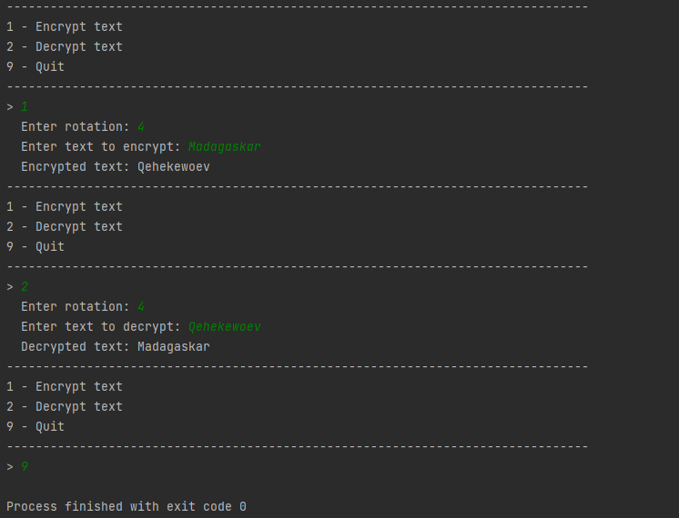

# Encryption #
## Description ##
Program either encrypts or decrypts a given text by shifting the letters the contains of to the left or right.

## HOW TO USE ## 
ENCRYPT: Enter 1 in the menu, then enter numbers or letters you want to encrypt to, then enter word/sentence to encrypt

DECRYPT: Enter 2 in the menu, then enter numbers or letters you want to decrypt to, then enter word/sentence to decrypt

QUIT: Enter 9 in consol

# Screenshots of output #

